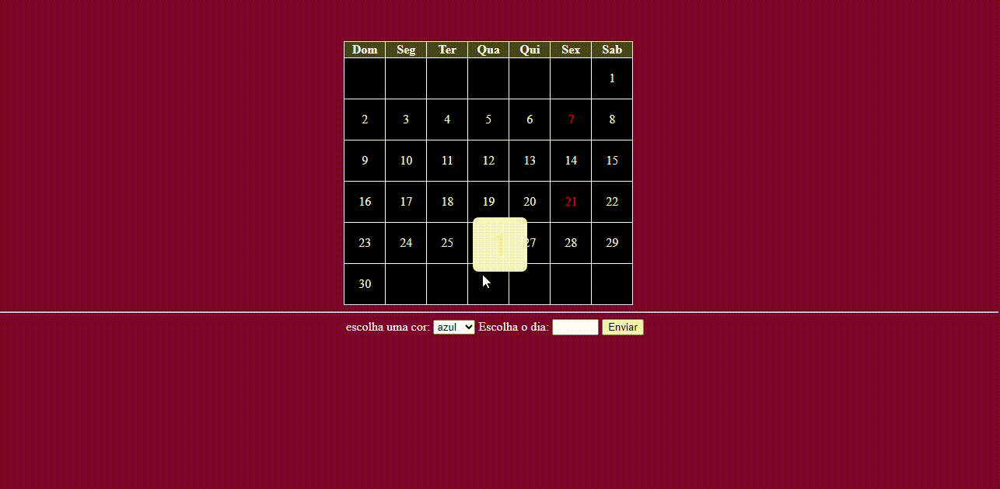

 

# Índice

[Projeto - portifólio para escrita do README.](#projeto---portif%C3%B3lio-para-escrita-do-readme)  

[descrição](#descri%C3%A7%C3%A3o)  

[Funcionalidades](#funcionalidades)    

[Tecnologias Utilizadas](#tecnologias-utilizadas)  

[Fontes consultadas](#fontes-consultadas)    

[Autores](#autores)  

 

#  📅 Projeto - calendario para escrita do README.

calendario digital

## 📋 descrição

Esse calendario feito na aula de progamação do marista, é um calendario digital feito para renovar e atualizar os calendarios ultapassados.

## 🔧 Funcionalidades

Esse projeto é utilizado para ver o dia, e se o usuario quiser marcar um dia especifico ele pode selecionar uma cor para destacar.

### 🛠️ Tecnologias Utilizadas

   - `github`  

   - `README`

   - `CSS`  

   - `HTML`  

   - `JS`  
 
## ✒️ Autores

[•Amanda vitoria](https://github.com/amandvitoria)  

[•Leonardo Rocha](https://github.com/LeonardoRochaMarista)  
